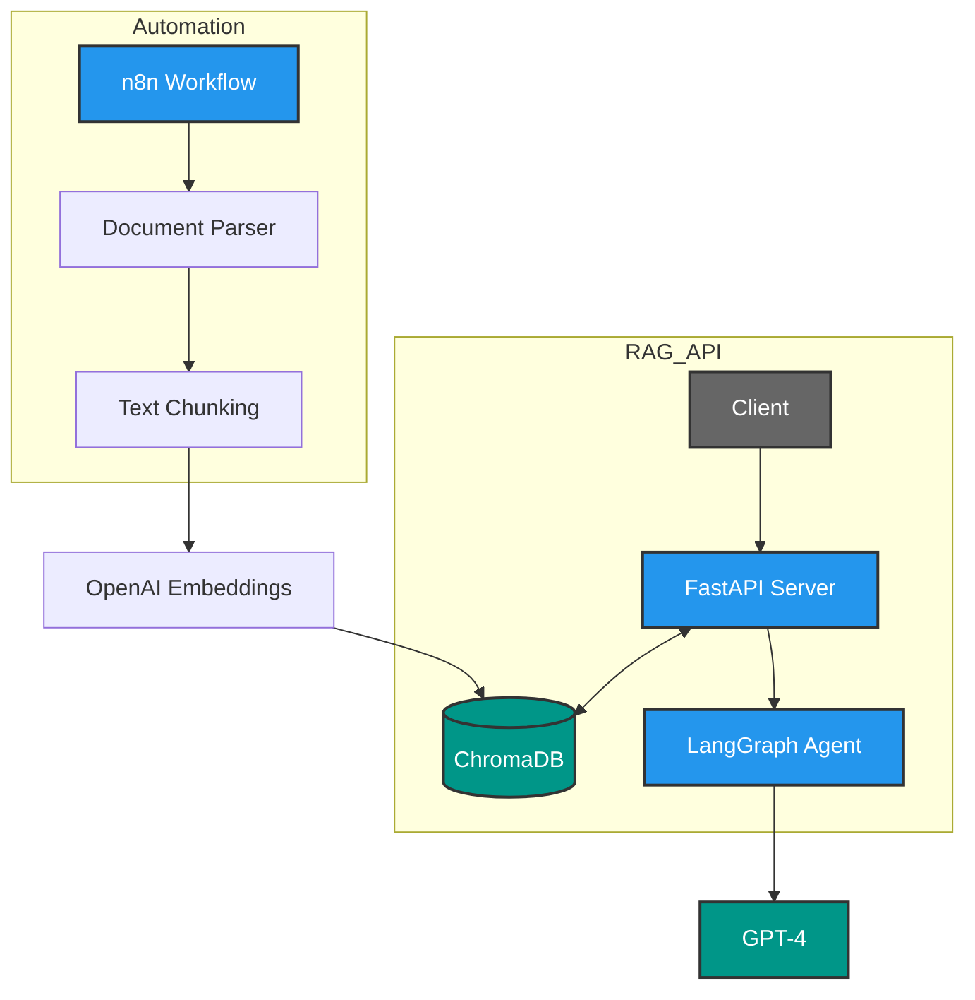

# 🤖 Intelligent Document RAG Assistant

[](https://python.org)
[](https://fastapi.tiangolo.com)
[](https://langchain.com)
[](https://trychroma.com)
[](https://docker.com)

An enterprise-grade Retrieval-Augmented Generation (RAG) system featuring autonomous agent capabilities, built with LangChain, LangGraph, and FastAPI. Includes automated document processing pipelines orchestrated via n8n.



## 🌟 Key Features

- **🔍 Advanced RAG Pipeline**: Context-aware document querying with ChromaDB vector storage and semantic search.
- **🧠 Autonomous Agent Architecture**: Multi-step reasoning using LangGraph workflows with self-correction loops.
- **⚡ Production-Ready API**: FastAPI backend with rate limiting, error handling, and async processing.
- **🔧 No-Code Automation**: n8n integration for automated document ingestion and embedding generation.
- **🐳 Containerized Deployment**: Docker support for scalable cloud deployment.
- **📊 Source Attribution**: Retrieved document chunks cited in responses for transparency.

## 🚀 Tech Stack

- **Agent Framework**: LangChain & LangGraph (for agent orchestration)
- **Vector Database**: ChromaDB (open-source embedding storage)
- **LLM**: OpenAI GPT-4/3.5 with function calling
- **API Framework**: FastAPI (async Python web framework)
- **Automation**: n8n (workflow automation)
- **Deployment**: Docker & Docker Compose
- **Embeddings**: OpenAI text-embedding-3-small

## 📁 Project Structure

rag-document-assistant/
├── app/
│   ├── api/routes.py          # FastAPI endpoints
│   ├── core/config.py         # Environment configuration
│   ├── models/schemas.py      # Pydantic models
│   └── services/              
│       ├── rag_pipeline.py    # Core RAG logic
│       ├── agent.py           # LangGraph agent setup
│       └── vector_store.py    # ChromaDB operations
├── n8n/document_workflow.json # n8n workflow export
├── docker-compose.yml
├── Dockerfile
└── requirements.txt
```

## 🛠️ Installation & Setup

### Prerequisites
- Python 3.9+
- Docker & Docker Compose (optional)
- OpenAI API Key
- n8n instance (local or cloud)

### Local Setup

1. **Clone the repository**
   ```bash
   git clone https://github.com/YOUR_GITHUB_USERNAME/rag-document-assistant.git
   cd rag-document-assistant
   ```

2. **Create virtual environment**
   ```bash
   python -m venv venv
   source venv/bin/activate  # On Windows: venv\Scripts\activate
   ```

3. **Install dependencies**
   ```bash
   pip install -r requirements.txt
   ```

4. **Set environment variables**
   ```bash
   cp .env.example .env
   # Edit .env with your OpenAI API key
   ```

5. **Run the FastAPI server**
   ```bash
   uvicorn app.main:app --reload --host 0.0.0.0 --port 8000
   ```

6. **Docker Deployment (Optional)**
   ```bash
   docker-compose up -d
   ```

## 🔌 API Endpoints

### 1. Upload Document
**POST** `/upload`
Uploads a PDF or text file for processing and embedding.

```http
POST /upload
Content-Type: multipart/form-data
file: <your-document.pdf>
```

**Response:**
```json
{
  "status": "success",
  "document_id": "doc_12345",
  "chunks_processed": 42,
  "message": "Document processed and embedded successfully"
}
```

### 2. Query Knowledge Base
**POST** `/query`
Ask questions about the uploaded documents.

```json
{
  "question": "What are the key features of the RAG system?",
  "top_k": 5
}
```

**Response:**
```json
{
  "answer": "The RAG system features semantic search...",
  "sources": [
    {
      "content": "Relevant text chunk...",
      "document": "document.pdf",
      "score": 0.92
    }
  ],
  "agent_steps": [
    "Retrieved 5 relevant chunks",
    "Generated response using GPT-4"
  ]
}
```

## 📸 Project Screenshots

| API Documentation (Swagger) | n8n Workflow | Chat Interface |
|:---------------------------:|:------------:|:--------------:|
|  |  |  |

<!-- 
Instructions to maintainers:
To update screenshots, place them in the /docs folder:
- docs/swagger.png
- docs/n8n-workflow.png
- docs/query-demo.png
-->

## 🔄 n8n Automation Workflow 

The included n8n workflow automates document processing:
1. **Trigger**: HTTP webhook or scheduled cron job
2. **Fetch**: Download documents from email/Google Drive
3. **Parse**: Extract text from PDFs/DOCX
4. **Chunk**: Split text using recursive character splitter
5. **Embed**: Generate OpenAI embeddings
6. **Store**: Upsert to ChromaDB via API call

**How to Import:**
1. Open n8n dashboard
2. Go to **Settings** → **Import workflow**
3. Select `n8n/document_workflow.json`

## 🧠 LangGraph Agent Logic

The system uses a state graph for agent decision-making:

```python
# Simplified agent architecture
class AgentState:
    question: str
    retrieved_docs: List[Document]
    final_answer: str

# Graph nodes
graph = StateGraph(AgentState)
graph.add_node("retrieve", retrieve_documents)
graph.add_node("generate", generate_response)

# Edges
graph.set_entry_point("retrieve")
graph.add_edge("retrieve", "generate")
```

## 🎯 Future Roadmap

- [ ] **Multi-Modal Support**: Add image processing with CLIP embeddings
- [ ] **Advanced Agent Tools**: Integration with web search (Tavily/SerpAPI)
- [ ] **Streaming Responses**: SSE implementation for real-time token streaming
- [ ] **Auth System**: JWT authentication and user document isolation
- [ ] **LangSmith Integration**: Detailed tracing and monitoring

## 📝 Internship Context

This project was built to demonstrate expertise in:
- **Agentic AI**: Building autonomous decision-making systems with LangGraph.
- **RAG Systems**: Practical implementation of retrieval-augmented generation.
- **Workflow Automation**: n8n integration for no-code/low-code automation.
- **Production Deployment**: Docker containerization and FastAPI best practices.

## 📄 License

MIT License - feel free to use for educational and commercial purposes.

## 🤝 Contact

For questions or collaboration:

- **LinkedIn**: [Muhammad Mohid Abbas](https://www.linkedin.com/in/muhammad-mohid-abbas/)
- **Email**: [mohidabbas.ai@gmail.com](mailto:mohidabbas.ai@gmail.com)