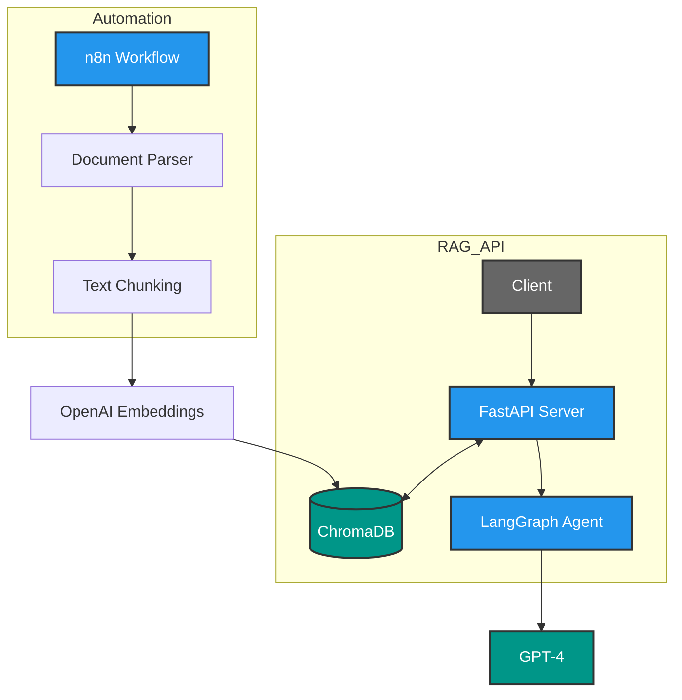
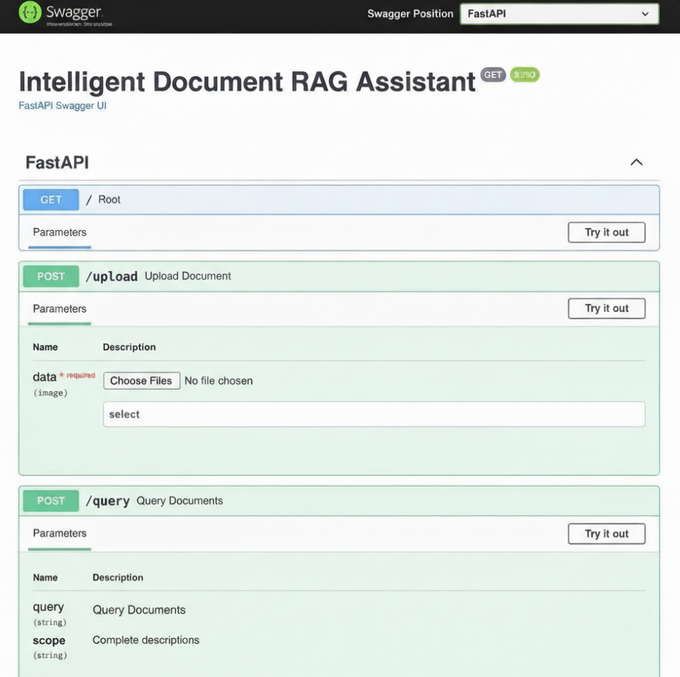
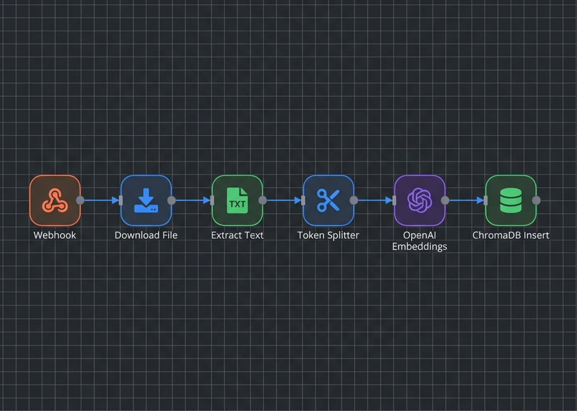
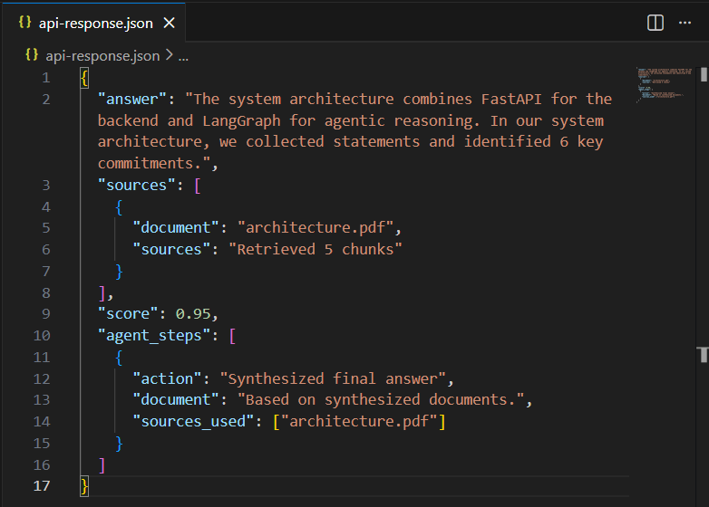

# 🤖 Intelligent Document RAG Assistant

[](https://python.org)
[](https://fastapi.tiangolo.com)
[](https://langchain.com)
[](https://trychroma.com)
[](https://docker.com)

An enterprise-grade Retrieval-Augmented Generation (RAG) system featuring autonomous agent capabilities, built with LangChain, LangGraph, and FastAPI. Includes automated document processing pipelines orchestrated via n8n.



## 🌟 Key Features

- **🔍 Advanced RAG Pipeline**: Context-aware document querying with ChromaDB vector storage and semantic search
- **🧠 Autonomous Agent Architecture**: Multi-step reasoning using LangGraph workflows with self-correction loops
- **⚡ Production-Ready API**: FastAPI backend with rate limiting, error handling, and async processing
- **🔧 No-Code Automation**: n8n integration for automated document ingestion and embedding generation
- **🐳 Containerized Deployment**: Docker support for scalable cloud deployment
- **📊 Source Attribution**: Retrieved document chunks cited in responses for transparency

## 🏗️ Architecture Overview

┌─────────────────┐     ┌──────────────────┐     ┌─────────────────┐
│   n8n Workflow  │────▶│  Document Parser │────▶│  Text Chunking  │
│  (Automation)   │     │  (PDF/TXT/DOCX)  │     │   & Cleaning    │
└─────────────────┘     └──────────────────┘     └─────────────────┘
│
▼
┌─────────────────┐     ┌──────────────────┐     ┌─────────────────┐
│  FastAPI Server │◀────│   ChromaDB       │◀────│ OpenAI Embedding│
│  (REST API)     │     │  (Vector Store)  │     │   Generation    │
└─────────────────┘     └──────────────────┘     └─────────────────┘
│
▼
┌─────────────────┐     ┌──────────────────┐
│  LangGraph      │────▶│   GPT-4/3.5      │
│  Agent Logic    │     │  (LLM Response)  │
└─────────────────┘     └──────────────────┘


## 🚀 Tech Stack

- **Agent Framework**: LangChain & LangGraph (for agent orchestration)
- **Vector Database**: ChromaDB (open-source embedding storage)
- **LLM**: OpenAI GPT-4/3.5 with function calling
- **API Framework**: FastAPI (async Python web framework)
- **Automation**: n8n (workflow automation)
- **Deployment**: Docker & Docker Compose
- **Embeddings**: OpenAI text-embedding-3-small

## 📁 Project Structure

rag-document-assistant/
├── app/
│   ├── api/
│   │   └── routes.py          # FastAPI endpoints
│   ├── core/
│   │   ├── config.py          # Environment configuration
│   │   └── security.py        # Rate limiting & auth
│   ├── models/
│   │   └── schemas.py         # Pydantic models
│   └── services/
│       ├── rag_pipeline.py    # Core RAG logic
│       ├── agent.py           # LangGraph agent setup
│       └── vector_store.py    # ChromaDB operations
├── n8n/
│   └── document_workflow.json # n8n workflow export
├── docker-compose.yml
├── Dockerfile
└── requirements.txt


## 🛠️ Installation & Setup

### Prerequisites
- Python 3.9+
- Docker & Docker Compose (optional)
- OpenAI API Key
- n8n instance (local or cloud)

### Local Setup

1. **Clone the repository**
```bash
git clone https://github.com/YOUR_GITHUB_USERNAME/rag-document-assistant.git
cd rag-document-assistant


2. **Create virtual environment**
```bash
python -m venv venv
source venv/bin/activate  # On Windows: venv\Scripts\activate


3. **Install dependencies**
```bash
pip install -r requirements.txt


4. **Set environment variables**
```bash
cp .env.example .env
# Edit .env with your OpenAI API key:
OPENAI_API_KEY=sk-your-key-here
CHROMA_DB_PATH=./chroma_db

5. **Run the FastAPI server**
```bash
uvicorn app.main:app --reload --host 0.0.0.0 --port 8000

6. **Access API documentation**
    Swagger UI: http://localhost:8000/docs
    ReDoc: http://localhost:8000/redoc

7. **Docker Deployment**
```bash
docker-compose up -d

This will start:
    FastAPI server on port 8000
    ChromaDB persistence volume
    Optional: n8n on port 5678


🔌 API Endpoints

1. Upload Document
```http
POST /upload
Content-Type: multipart/form-data

file: <your-document.pdf>

Response:

{
  "status": "success",
  "document_id": "doc_12345",
  "chunks_processed": 42,
  "message": "Document processed and embedded successfully"
}

2. Query Knowledge Base
```http
POST /query
Content-Type: application/json

{
  "question": "What are the key features of the RAG system?",
  "top_k": 5
}

Response:

```json

{
  "answer": "The RAG system features semantic search...",
  "sources": [
    {
      "content": "Relevant text chunk...",
      "document": "document.pdf",
      "page": 3,
      "score": 0.92
    }
  ],
  "agent_steps": [
    "Retrieved 5 relevant chunks",
    "Generated response using GPT-4"
  ]
}


🔄 n8n Automation Workflow 

The included n8n workflow automates document processing:
1. Trigger: HTTP webhook or scheduled cron job
2. Fetch: Download documents from email/Google Drive
3. Parse: Extract text from PDFs/DOCX
4. Chunk: Split text using recursive character splitter
5. Embed: Generate OpenAI embeddings
6. Store: Upsert to ChromaDB via API call

To import:

1. Open n8n dashboard
2. Settings → Import workflow
3. Select n8n/document_workflow.json
4. Configure credentials (OpenAI, Google Drive, etc.)


🧠 LangGraph Agent Logic

The system uses a state graph for agent decision-making:

```python
# Simplified agent architecture
class AgentState:
    question: str
    retrieved_docs: List[Document]
   tool_calls: List[ToolCall]
    final_answer: str

# Graph nodes
graph = StateGraph(AgentState)
graph.add_node("retrieve", retrieve_documents)
graph.add_node("grade", grade_relevance)
graph.add_node("generate", generate_response)
graph.add_node("rewrite", rewrite_query)

# Conditional edges based on document relevance
graph.add_conditional_edges(
    "grade",
    decide_to_generate,
    {"generate": "generate", "rewrite": "rewrite"}
)
```

### 📸 Project Screenshots

> **Build your portfolio!** Run the app and take screenshots to replace the placeholders below.

| API Documentation (Swagger) | n8n Workflow | Chat Interface |
|:---------------------------:|:------------:|:--------------:|
|  |  <br> *Export the n8n workflow* |  <br> *Example query response* |

**Instructions to add screenshots:**
1.  Create a `docs` folder in your project root.
2.  Take a screenshot of the Swagger UI and save as `docs/swagger.png`.
3.  Take a screenshot of your n8n canvas and save as `docs/n8n-workflow.png`.
4.  Take a screenshot of a successful API response and save as `docs/query-demo.png`.


🎯 Future Roadmap
[ ] Multi-Modal Support: Add image processing with CLIP embeddings
[ ] Advanced Agent Tools: Integration with web search (Tavily/SerpAPI)
[ ] Streaming Responses: SSE implementation for real-time token streaming
[ ] Auth System: JWT authentication and user document isolation
[ ] LangSmith Integration: Detailed tracing and monitoring

📝 Context
This project was built to demonstrate expertise in:
Agentic AI: Building autonomous decision-making systems with LangGraph
RAG Systems: Practical implementation of retrieval-augmented generation
Workflow Automation: n8n integration for no-code/low-code automation
Production Deployment: Docker containerization and FastAPI best practices

📄 License
MIT License - feel free to use for educational and commercial purposes.

🤝 Contact
For questions or collaboration:
LinkedIn: [Muhammad Mohid Abbas](https://www.linkedin.com/in/muhammad-mohid-abbas/)
Email: [mohidabbas.ai@gmail.com](mailto:mohidabbas.ai@gmail.com)